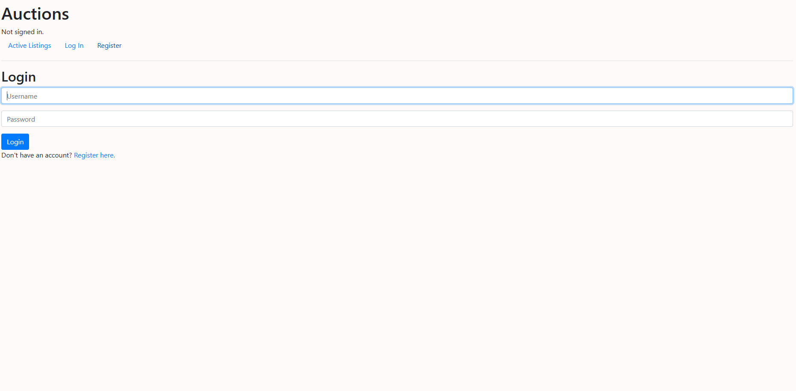
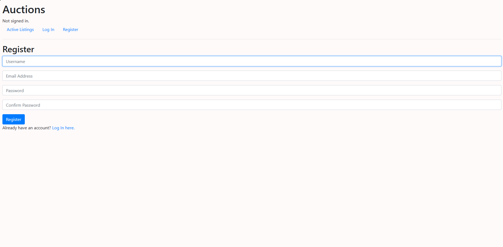
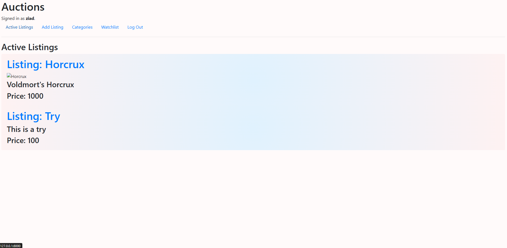
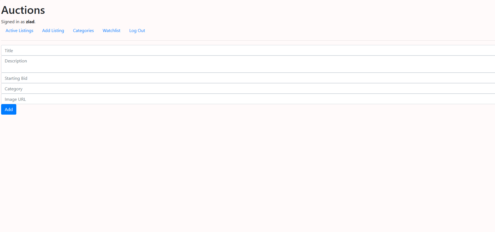
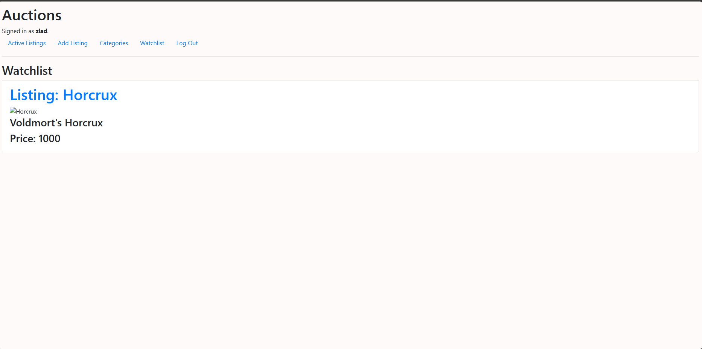
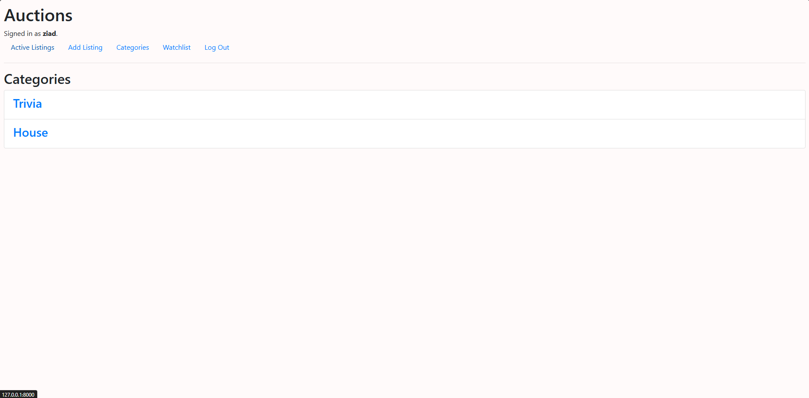

# Auction Website

## Introduction

This project is a web application for an auction platform where users can create listings, place bids, and comment on items. It is built using Django, a high-level Python web framework.

## Usage

1. **Register an account** to start creating and bidding on listings.
2. **Log in** after registering you can logout and login at anytime.
3. **Create a new listing** by navigating to the listing page and filling in the details.
4. **Place bids** on active listings.
5. **Comment** on listings to share your thoughts or ask questions.
6. **Close bidding** on your own listings when you're ready to finalize the sale.
7. **Category search** view items by their category
8. **Watchlist** Add items to watchlist.

## Features

- User authentication and registration.
- Create, update, and delete listings.
- Place bids on active listings.
- Comment on listings.
- Add listings to a personal watchlist.
- View listings by category.
- Add a listing to your watchlist

## Dependencies

- Django
- Python 3.x

Refer to `requirements.txt` for the complete list of dependencies.

## Configuration

1. **Database settings:**
   Configure your database settings in `settings.py`.

2. **Static files:**
   Collect static files using:
   ```bash
   python manage.py collectstatic

3. **Environment variables:**
Set environment variables for sensitive information like SECRET_KEY, database credentials, etc.

## Documentation

### Models
* User: Extends Django's AbstractUser model.
* Listing: Represents an auction listing with fields like title, description, price, image, * user, active, and category.
* Bid: Represents a bid on a listing with user, item, and value fields.
* Comments: Represents comments on listings with user, item, and comment fields.
* Watchlist: Represents a user's watchlist, linking users and listings.

### Views
* index: Shows all active listings.
* login_view: Handles user login.
* logout_view: Handles user logout.
* register: Handles user registration.
* list: Allows users to create a new listing.
* details: Shows details of a specific listing.
* watchlist: Shows a user's watchlist.
* place_bid: Handles placing a bid on a listing.
* close_bid: Allows a user to close bidding on their listing.
* comment: Handles commenting on a listing.
* category: Shows available categories.
* category_list: Shows listings within a specific category.

### URL Patterns
* /: Home page showing active listings.
* /login: Login page.
* /logout: Logout view.
* /register: Registration page.
* /list: Page to create a new listing.
* /list/<int:listing_id>: Page to view listing details.
* /watchlist: User's watchlist.
* /place_bid: Place a bid on a listing.
* /close_bid: Close bidding on a listing.
* /comment: Add a comment to a listing.
* /category: View available categories.
* /category/<str:category>: View listings by category.

## Examples
1. Creating a Listing:

* Navigate to /list and fill out the form with the listing details.
2. Placing a Bid:

* View a listing and place a bid using the bid form.
3. Commenting on a Listing:

* Add a comment on a listing's detail page.

[Link to hosted site]<http://commerce1.pythonanywhere.com/>

## Login page
 

## Register page


## Listings view


## Add listing 


## Watchlist


## Categories
